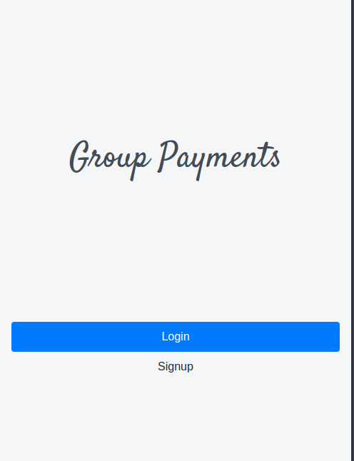
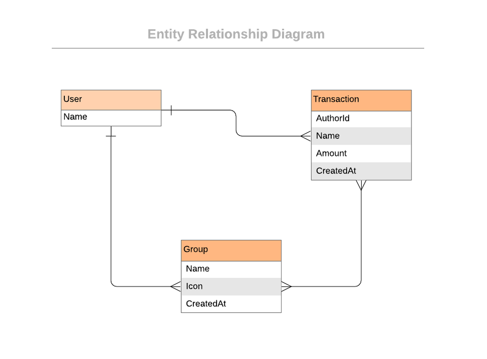

# Group Payments

> Group Payments is a web app that allows you to group payments with your friends and family.

The app has the following features:

- User can signup and login
- Guest user can't access any other page in the app except home, login and signup pages
- Logged in user can access her and only her profile page
- Profile page provides links to "All Payments", "All External Payments" and "Groups"
- Logged in user can view all payments and create new ones which can be assigned to a group
- Logged in user can view all groups and create a new
- Logged in user can visit show page of a group which will list all payments associated with it

The data models were constructed according to the following Entity Relationship Diagram(ERD):

## Built With

- Ruby 2.7.2
- Rails 6.0.3.4
- Bootstrap 4.5

## Live Demo

[Group Payments](https://protected-temple-83380.herokuapp.com/)

## Getting Started

### Prerequisites

1. Open Terminal
2. Clone the repository `git clone https://github.com/meronokbay/group-payments`
3. Move into project directory `cd group-payments`
4. Install required gems `bundle install`
5. Create database `rails db:create`
6. Run database migration `rails db:migrate`
7. Seed the database with `rails db:seed`
8. Start your server `rails server`
9. Open the app on your browser by visiting the link `http://localhost:3000`

### Testing

RSpec was used for testing and several test use cases have been created. To test, simply follow the instructions below:

1. Open Terminal
2. Make sure you are in the root directory
3. Run `rspec` in your terminal to run all tests

## Authors

👤 **Meron Ogbai**

- Github: [@meronokbay](https://github.com/meronokbay)
- Twitter: [@MeronDev](https://twitter.com/MeronDev)
- Linkedin: [Meron Ogbai](https://linkedin.com/in/meron-ogbai/)

## Acknowledgments

The design of the project was inspired by [Snapscan](https://www.behance.net/gallery/19759151/Snapscan-iOs-design-and-branding) by [Gregoire Vella](https://www.behance.net/gregoirevella).

## 🤝 Contributing

Contributions, issues, and feature requests are welcome!

## Show your support

Give a ⭐️ if you like this project!

## 📝 License

This project is [MIT](lic.url) licensed.
